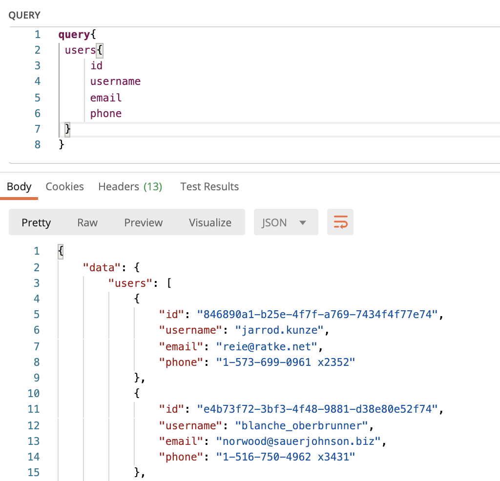
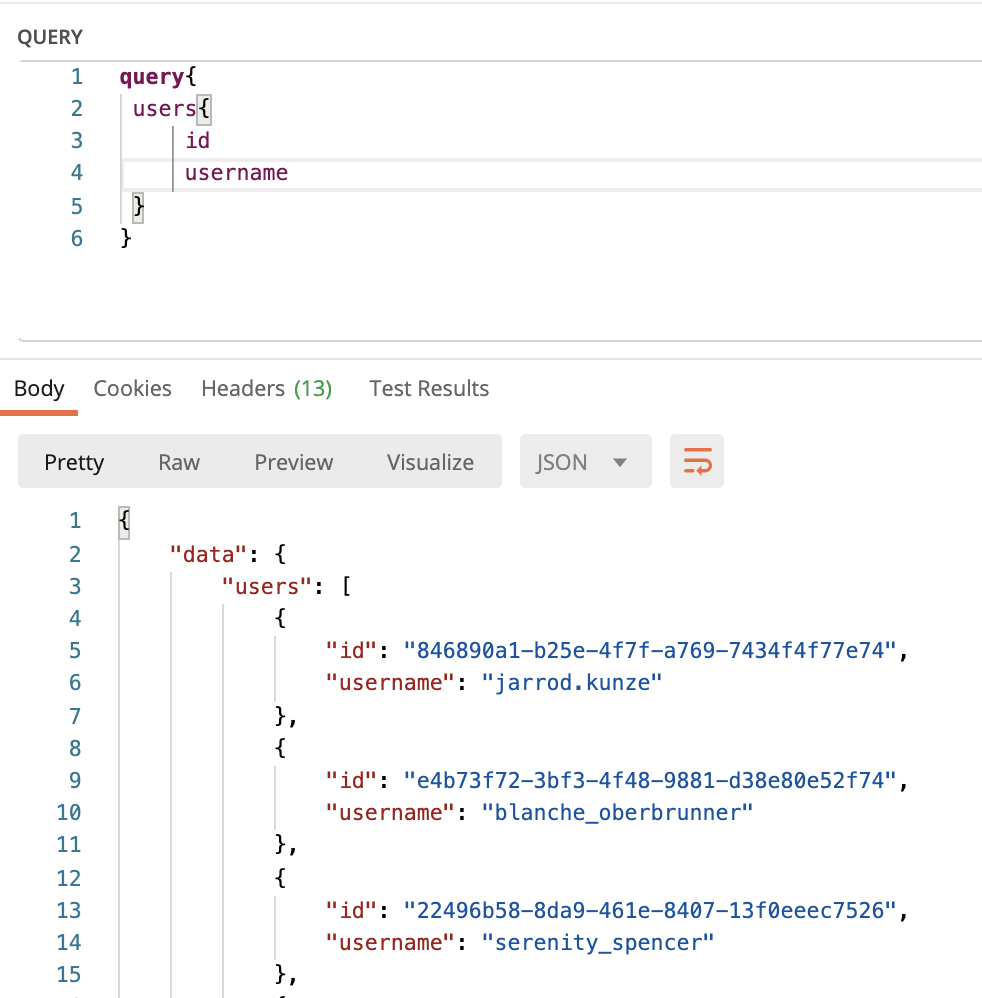

# AVAAMO EVENT MANAGER - GRAPHQL VERSION

[Main branch with REST api][https://github.com/bezoar17/avaamo-event-manager/tree/graphql]

```
  This branch uses graphql as the api contract. Due to this all controllers are replaced by one graphql controller
  and api definitions also change a bit. All changes are limited to controllers, models, servies etc remain as is.
```

## Routes
| Verb | URI Pattern | Controller#Action |
| ------ | ------ | ------ |
| POST | /graphql                 | graphql#execute |

```
All requests are post calls to this single endpoint, body of the request would contain {query: "query string"}.
Query String can have either a query(reads, equivalent to get calls) or a mutation(writes, like PUT/POST etc.)
```

## API definition

Following are the graphql equivalent queries for each operation. Graphql also allows client to select attributes from
an entity like user. Below are 2 query operations which select different attributes
while getting list of users, the responses change and match the client request without any change done at the server.

all params | only username and id
-|-
 | 

### User actions

* `GET  /api/v1/users`
  ```graphql

  query{
     users{
         id
         username
         email
         phone
     }
    }
  ```

* `GET  /api/v1/users/:id`
  ```graphql

  query{
     user(id: "ajdnfjs"){
         id
         username
         email
         phone
     }
    }
  ```

* `GET  /api/v1/users/:id/events?start_date&=end_date=`
`List all events user has been invited to. Sending start_date and end_date will filter events based on these dates`
  ```graphql

  query{
     user(id: "ajdnfjs"){
         id
         username
         email

         events(start_date: , end_date:){
            id
            title
            starttime
            endtime
         }
     }
    }
  ```


* `GET  /api/v1/users/:id/availability?start_date=&end_date=&slot_size=`
`List user availability in blocks of slot_size(in seconds) param. start_date, end_date are required params, slot_size is optional whose default value is 7200.`
```graphql

  query{
     user(id: "ajdnfjs"){
         id
         username
         email

         availability(start_date: , end_date:){
            starttime
            endtime
            available
         }
     }
    }
  ```


* `POST  /api/v1/users/`
  `Create a user with the given parameters. username, email and phone-no all 3 are required`
  ```graphql

  mutation{
     create_user(username: "ajdnfjs", email: , phone:){
         user
            {
              id
              username
              email
            }
     }
    }
  ```

### Event action

* `GET  /api/v1/events`
  `List all registered events`
  ```graphql

  query{
     events{
        title
        starttime
        endtime
        allday
     }
    }
  ```

* `GET  /api/v1/events/:id`
  `Get event for the given id, raise 404 if event is not present`
  ```graphql

  query{
     event(id: ){
        title
        starttime
        endtime
        allday
     }
    }
  ```

* `GET  /api/v1/events/:id/invitees`
  `Get all users invited to an event`
  ```graphql

  query{
     event(id: ){
        invitees { # these are user-objects
          id
          username
          email
        }
     }
    }
  ```

* `GET  /api/v1/events/:id/rsvps`
  `Get all users invited to an event, who have rsvpd(any value)`

  ```graphql

  query{
     event(id: ){

        rsvps { # these are event-user-objects
          user{
            username
          }
          event{
            title
          }
          rsvp
        }


     }
    }
  ```

* `PUT  /api/v1/events/:id/users?ids[]=&ids[]=`

  `Takes ids(array of user_ids) as a parameter. Invites all uninvited users to the event. This endpoint only invites users if they were uninvited, it does not remove any invited user whose id is not in the parameter`
  ```graphql

  mutation{
     add_users(user_ids: ["ajdnfjs", "sfds"], event_id: ){
         success
     }
    }
  ```


* `PUT  /api/v1/events/:id/rsvp`
  `Rsvp to an event by id. Action performed for the current_user.`
    ```graphql

  mutation{
     rsvp_to_event(event_id: , rsvp:){
         success
     }
    }
  ```

* `POST  /api/v1/events/`
  `Create an event with given parameters. Throws error for invalid params`
  ```graphql

  mutation{
     create_event(starttime: , endtime: , allday:){
         event
            {
              title
              starttime
              endtime
              allday
            }
     }
    }